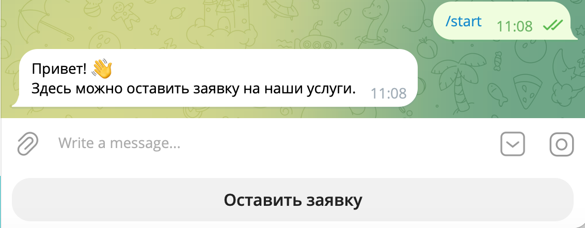
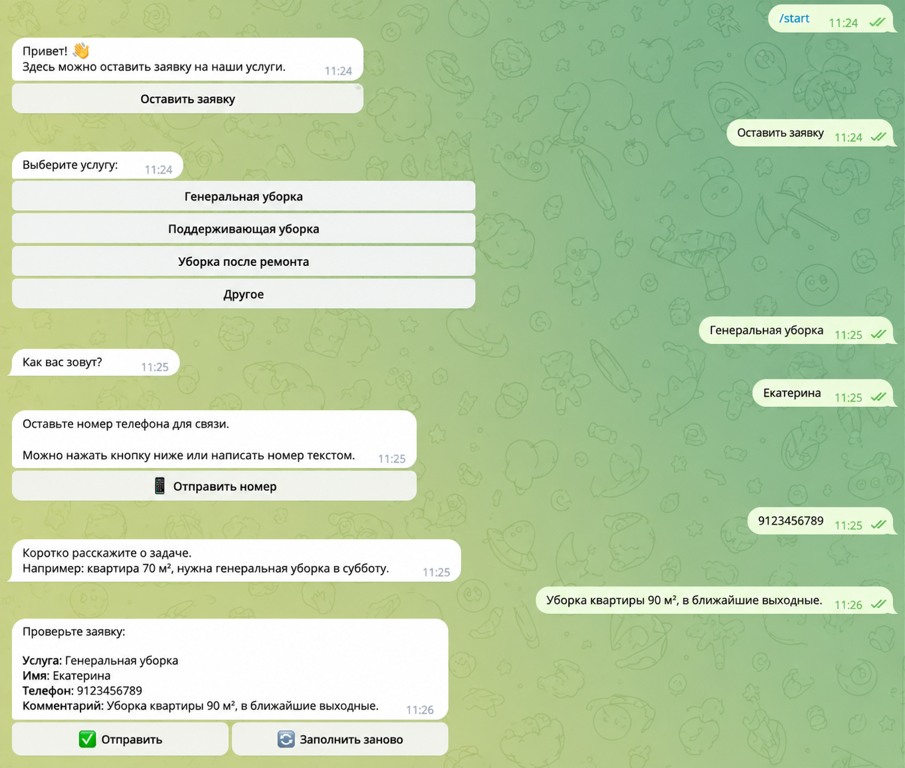
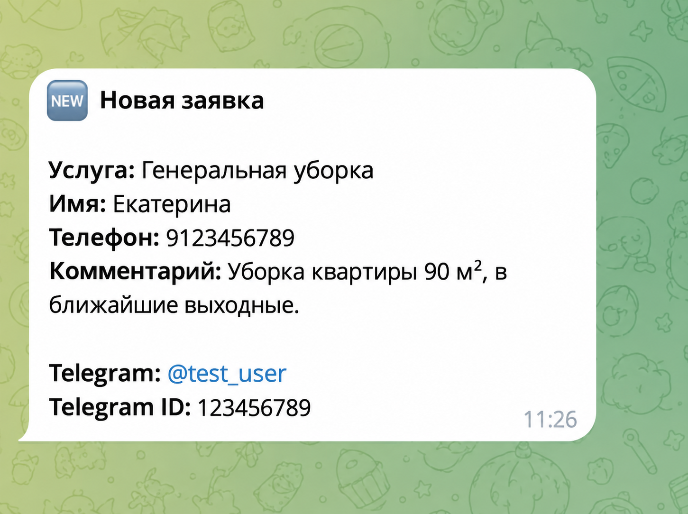
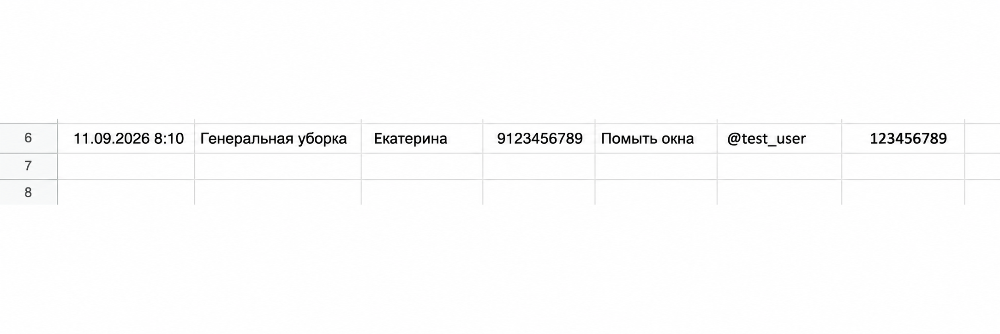

# Telegram Leads Bot

Telegram-бот для автоматизации приёма клиентских заявок небольшого бизнеса.

Пользователь проходит пошаговый сценарий в Telegram, после чего данные заявки автоматически сохраняются в Google Sheets и отправляются администратору. Проект развёрнут на VPS и работает независимо от локального компьютера.

## Как работает

```text
Клиент
  ↓
Telegram Bot
  ↓
Python / aiogram
  ↓
Google Sheets
  ↓
Администратор
```

## Скриншоты

### Стартовый экран


### Подтверждение заявки


### Уведомление администратору


### Запись в Google Sheets



## Возможности

- пошаговый сбор клиентской заявки;
- выбор услуги;
- возможность указать свою услугу;
- сбор имени и телефона;
- получение номера через Telegram Contact или текстом;
- сбор комментария;
- предварительный просмотр заявки перед отправкой;
- повторное заполнение с очисткой предыдущих данных;
- отправка готовой заявки администратору;
- автоматическое сохранение заявки в Google Sheets;
- поддержка команд `/start` и `/cancel`;
- отдельное FSM-состояние для каждого пользователя;
- работа приложения на удалённом VPS.

## Пример сценария

1. Пользователь запускает бота через `/start`.
2. Нажимает «Оставить заявку».
3. Выбирает услугу или вводит свою.
4. Указывает имя.
5. Передаёт номер телефона.
6. Добавляет комментарий.
7. Проверяет введённые данные.
8. Подтверждает отправку.
9. Администратор получает новую заявку.
10. Данные автоматически добавляются в Google Sheets.

## Стек

- Python 3.11+
- aiogram 3
- Telegram Bot API
- Google Sheets API
- python-dotenv
- FSM / MemoryStorage
- Git
- Linux
- VPS

## Структура проекта

```text
telegram-leads-bot/
├── bot.py
├── config.py
├── google_sheets.py
├── handlers/
├── keyboards/
├── states/
├── .env.example
├── .gitignore
├── requirements.txt
└── README.md
```

## Конфигурация

Создайте `.env` в корне проекта.

Пример:

```text
BOT_TOKEN=your_bot_token
ADMIN_ID=your_admin_id
```

Секретные данные не хранятся в репозитории.

Для подключения Google Sheets также необходимы credentials сервисного аккаунта Google Cloud.

## Локальный запуск

Создайте виртуальное окружение:

### macOS / Linux

```bash
python3 -m venv .venv
source .venv/bin/activate
pip install -r requirements.txt
```

### Windows

```powershell
python -m venv .venv
.venv\Scripts\activate
pip install -r requirements.txt
```

Запуск:

```bash
python bot.py
```

или:

```bash
python3 bot.py
```

## Развёртывание

Проект развёрнут на удалённом Linux VPS и работает независимо от компьютера разработчика.

Это позволяет использовать бота как постоянно доступный сервис для обработки заявок.

## Что автоматизирует проект

Без автоматизации менеджеру приходится получать данные клиента из переписки и вручную переносить их в таблицу.

Бот переводит этот процесс в единый сценарий:

```text
Заявка клиента
       ↓
Структурированный сбор данных
       ↓
Google Sheets
       ↓
Менеджер получает готовую заявку
```

## Статус проекта

✅ Telegram-бот разработан  
✅ Сценарий сбора заявок реализован  
✅ Google Sheets подключён  
✅ Проект развёрнут на VPS  

## Возможное развитие

- хранение заявок в PostgreSQL;
- статусы заявок;
- CRM-интеграция;
- автоматические уведомления;
- отчёты для руководителя;
- Docker;
- CI/CD.